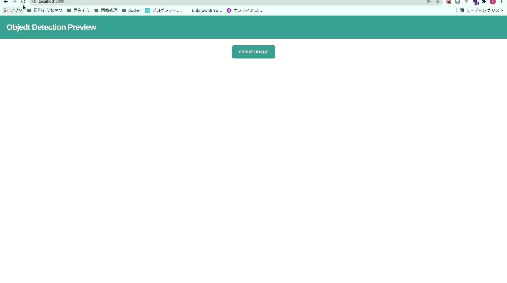

## 概要

アップロードした画像に対する物体検出結果を描画するアプリケーション

## アプリケーション起動方法

1. Docker image を作成

```
docker-compose build
```

2. コンテナ起動

```
docker-compose up
```

3. `localhost:3000`にアクセス

## アプリケーション使用方法

`localhost:3000`において、`model loading`というメッセージが消えた後に、以下のように物体検出実施対象画像を選択する。



## 使用技術

- フロントエンド

  - React

  - TypeScript

- 物体検出

  - tensorflow.js(ssd: https://github.com/tensorflow/tfjs-models/tree/master/coco-ssd)

## 参考

- https://qiita.com/mehdi/items/690f9c78d93f2bb5e211

- https://towardsdatascience.com/how-to-use-tensorflow-js-in-react-js-object-detection-98b3782f08c2
